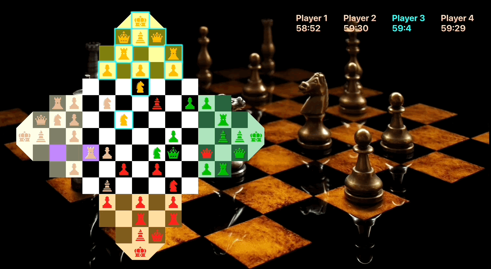
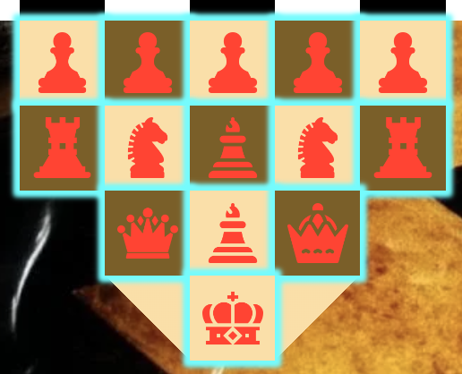
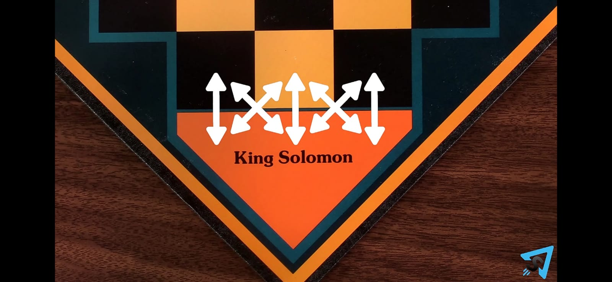
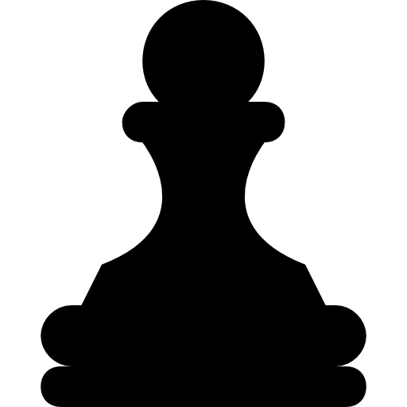
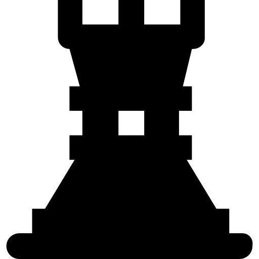

# Quadular Chess

## Version info:

- nodeJs version: v14.20.1
- npm version: 7.24.2

## Setup instructions:

- clone the repo in your machine
- run `npm install` to install dependencies
- run `npm run dev` to run the game on localhost:3000

### NearBy Mode:
- Choose this mode when you want to play in a single device.

### Remote Mode:
- Choose this mode when you want to connect multiple devices.
- run `npm run server` in a separate tab to get the server URL. Open the game in other devices using this URL which you want to connect.
- Host a new game using one of the device, select all required options and create a room.
- On other devices join the room using same roomId you entered while creating the room.

## Game Pieces Initial Placement:

- the `King` sits on the triangular cell called `Throne`.
- On next row in front of `King` sits `Bishop`, On left of `Bishop` sits `Queen` and right of `Bishop` sits `Prince`.
- On next row sits `Rook`, `Knight`, `Bishop`, `Knight` and `Rook` in same order as described.
- On next row sits all five `Pawns`.

  
## Game Terminologies:

### Throne: 
The triangular cell on which the king sits when the game starts is called Throne. A Throne is connected vertically and diagonally to all 3 squares in front of it as shown in image below.

### Domain:
The colored squares on which pieces are positioned at start of game represents a domain. A domain is not active if pieces are not set up on it while start of game in case of 2-3 players.

## Game Instructions:

- You can play this game 2-4 players. Each player needs to capture the king of all his opponents to win the game.
- Checkmating and Castling is not allowed, a player needs to kill his king to knock him out of game. 
- EnPassant is allowed as usual.
- Only `King` can move in and out of Throne freely, other pieces can only capture his opponent piece inside the throne.
- If a player's `King` gets killed, and he has a `Young King` on his side then his `Young King` is replaced with `King` and game continues. Otherwise, the player is out of the game.
- When a player captures his opponent `King` and his opponent has no `Young King` available on the board, the player gets to control his opponent pieces as his own, but he can not promote his opponents `Prince` or `Pawn`.
- A player is knocked out of game if his timer expires but his pieces are then not controlled by any other player. They just sit idle on the board and other players can capture them.
- No Piece can jump over other piece or kill their own ally pieces.
- Information about each piece is given as below:

### Pawn: 

  - a `Pawn` can move freely in forward, left and right direction by one square away from his own domain.
  - a `Pawn` can kill diagonally only.
  - while making, it's first move a `Pawn` can move forward with 2 squares.
  - a `Pawn` gets promoted to `Bishop`, `Queen` or `knight` when it reaches an opponent domain. 
  - In case of 2-3 players a pawn does not get promoted if it reaches a domain that was not part of the game.
  - a `pawn` can move diagonally towards his domain when he is entering in his opponents domain and killing an opponents piece.

### Prince: 

- a `Prince` can move freely in all directions by two squares.
- a `Prince` gets promoted to `Young King` when it reaches an opponent domain.
- a `prince` can kill in any direction.

### Young King: 

- a `Young King` can move freely in all directions by any number of squares.
- a `Young King` gets promoted to `Kng` if the `King` gets killed.
- a `Young King` can kill in any direction.
- a `Young King` is not present initially in the game and comes on board only when `Prince` gets promoted.

### Queen: 

- a `Queen` can move freely in all directions by any number of squares.
- a `Queen` can kill in any direction.

### Bishop: 

- a `Bishop` can move freely in both diagonal directions by any number of squares.
- a `Bishop` can kill in any diagonal direction.
- while coming out of throne a `Bishop` can move on same coloured squares as it was on while entering the throne.

### Knight: 

- a `Knight` can move L shaped in any direction.
- a `Knight` can kill in any direction.

### Rook: 

- a `Rook` can move freely in forward, left, right and bottom directions by any number of squares.
- a `Rook` can kill in any vertical direction.

### King: 

- a `King` can move freely in all directions by one square.
- a `King` can kill in all direction.
